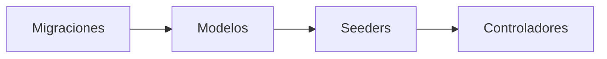

En Laravel, el orden recomendado para crear estos componentes sigue el flujo natural de desarrollo y las dependencias entre ellos. Aquí está la secuencia óptima:

---

### **Orden Recomendado** 🔄
1. **Migraciones**  
2. **Modelos**  
3. **Seeders**  
4. **Controladores**

---

### **Explicación Detallada** 📝

#### 1. **Migraciones**  
   - **¿Por qué primero?**  
     Las migraciones definen la estructura de la base de datos (tablas, columnas, relaciones).  
     Sin una base de datos estructurada, los modelos no tendrían una base para operar.  
   - **Ejemplo**:  
     ```bash
     php artisan make:migration create_users_table
     ```

#### 2. **Modelos**  
   - **¿Por qué después?**  
     Los modelos representan las tablas de la base de datos y permiten interactuar con ellas.  
     Se crean después de las migraciones para asegurar que la estructura de la tabla exista.  
   - **Práctica común**:  
     Crear modelos junto con sus migraciones usando:  
     ```bash
     php artisan make:model User -m  # -m crea la migración automáticamente
     ```

#### 3. **Seeders**  
   - **¿Por qué después de modelos?**  
     Los seeders insertan datos de prueba usando modelos o factories.  
     Necesitan que los modelos y las tablas ya estén definidos.  
   - **Ejemplo**:  
     ```bash
     php artisan make:seeder UserSeeder
     ```

#### 4. **Controladores**  
   - **¿Por qué al final?**  
     Los controladores manejan la lógica de la aplicación y suelen usar modelos para acceder a los datos.  
     Se crean después de los modelos para garantizar que las operaciones CRUD tengan una base sólida.  
   - **Ejemplo**:  
     ```bash
     php artisan make:controller UserController --model=User
     ```

---

### **Flujo de Trabajo Típico** 🛠️


---

### **Excepciones y Flexibilidad** 🔄
- **Seeders antes de modelos**: Si usas inserción directa con `DB::table()`, no necesitas modelos, pero es menos común.  
- **Controladores antes de modelos**: Puedes crear esqueletos de controladores, pero no podrás implementar la lógica hasta que existan los modelos.  

---

### **Pasos Adicionales Recomendados** ✅
1. **Ejecutar migraciones** después de crearlas:  
   ```bash
   php artisan migrate
   ```
2. **Generar factories** junto con modelos para datos falsos:  
   ```bash
   php artisan make:factory UserFactory --model=User
   ```
3. **Ejecutar seeders** para poblar la base de datos:  
   ```bash
   php artisan db:seed --class=UserSeeder
   ```

---

**¡Este orden garantiza un desarrollo limpio y evita errores de dependencias!** 🚀